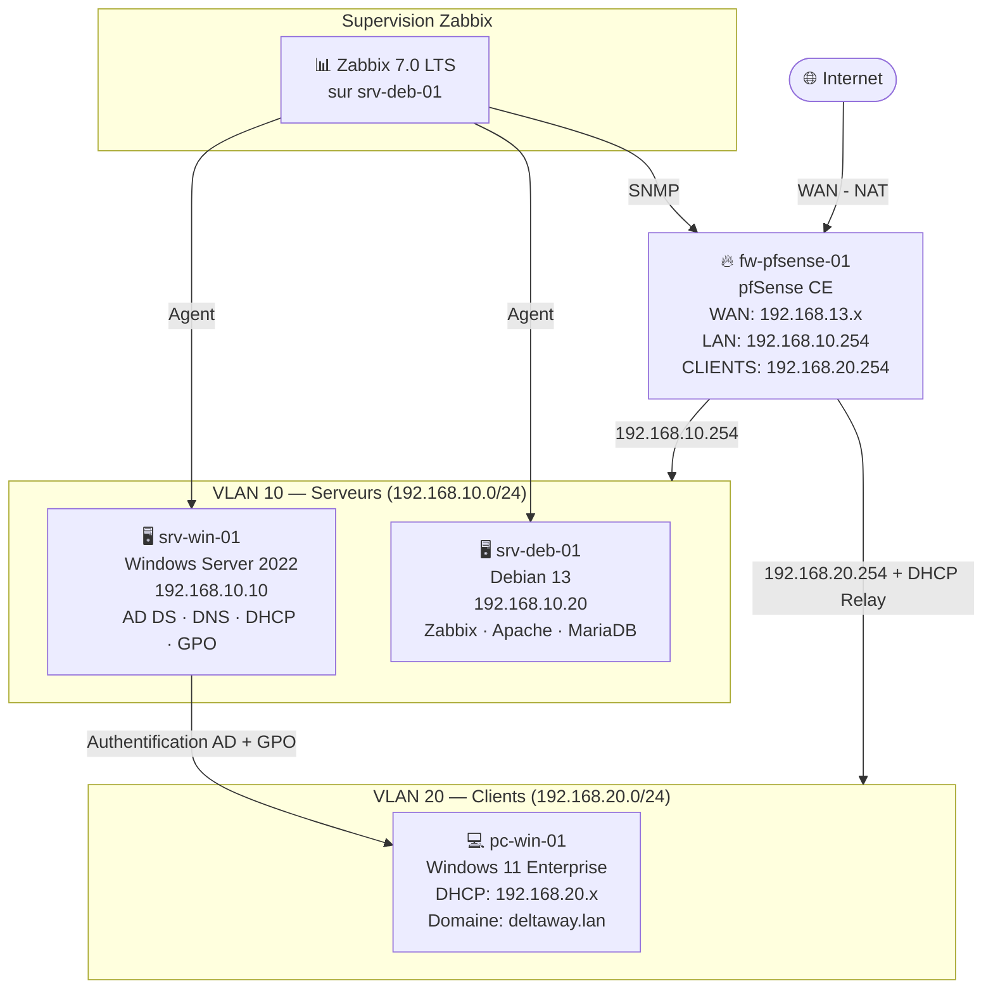

# DeltaWay Infrastructure

## À propos du projet

DeltaWay est une PME fictive pour laquelle j'ai été recruté en tant 
qu'administrateur systèmes et réseaux avec pour mission de concevoir 
et déployer l'infrastructure informatique from scratch.

Ce projet est construit dans le cadre de ma formation TSSR et évoluera 
progressivement au fil de mon parcours — formation, alternance et 
pratique personnelle.

## Infrastructure actuelle

L'infrastructure repose sur quatre composants :

- **fw-pfsense-01** — routeur et firewall central, assure la connexion 
  vers internet et le routage entre les différents réseaux internes
- **srv-win-01** — serveur Windows Server 2022, héberge l'Active Directory
- **srv-deb-01** — serveur Debian 13, héberge les services applicatifs
- **pc-win-01** — poste client Windows 11, joint au domaine DeltaWay

Le réseau est segmenté en deux VLANs :

| VLAN | Réseau | Rôle |
|------|--------|------|
| 10 | 192.168.10.0/24 | Serveurs |
| 20 | 192.168.20.0/24 | Postes clients |

## Pourquoi cette architecture

La segmentation en VLANs répond à un besoin de sécurité — isoler 
les serveurs des postes clients limite la propagation d'un incident. 
Un poste client compromis ne peut pas atteindre directement les serveurs.

pfSense a été choisi comme routeur/firewall car il offre les 
fonctionnalités d'un équipement pro sans coût de licence, 
et sa logique est transposable à des solutions comme Stormshield 
en environnement professionnel.

Supervision avec Zabbix qui est open-source et gratuit et qui me permet
de découvrir la supervision simplement.

## Stack technique

- **Hyperviseur** : VMware Workstation Pro
- **Hôte** : Ubuntu — AMD Ryzen 7 Pro — 32 GB RAM — 1 TB SSD
- **Firewall/Routeur** : pfSense CE
- **Serveur Windows** : Windows Server 2022
- **Serveur Linux** : Debian 13
- **Client** : Windows 11
- **Supervision** Zabbix
