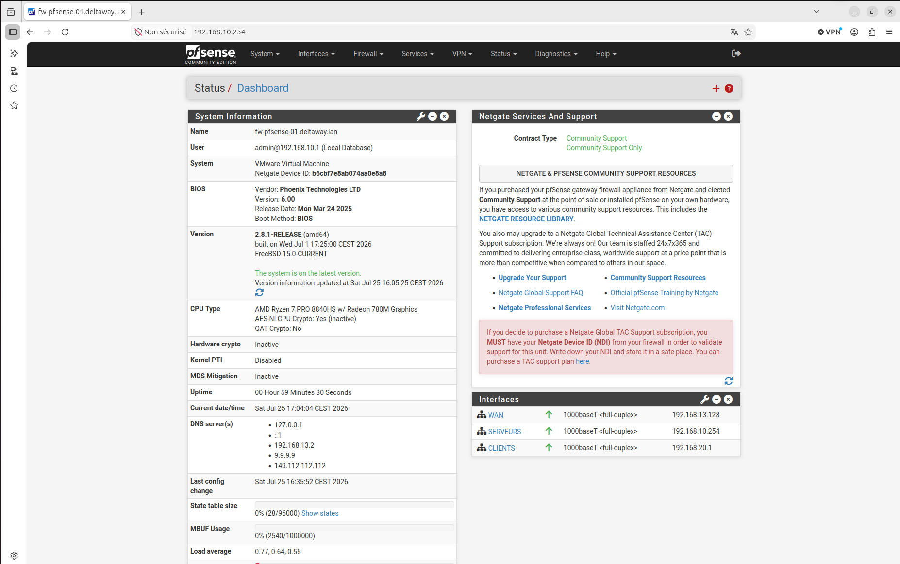
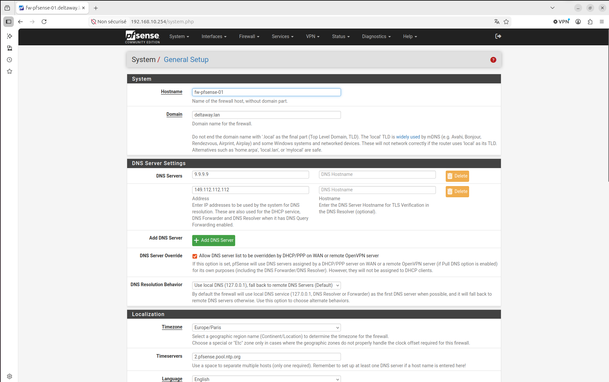
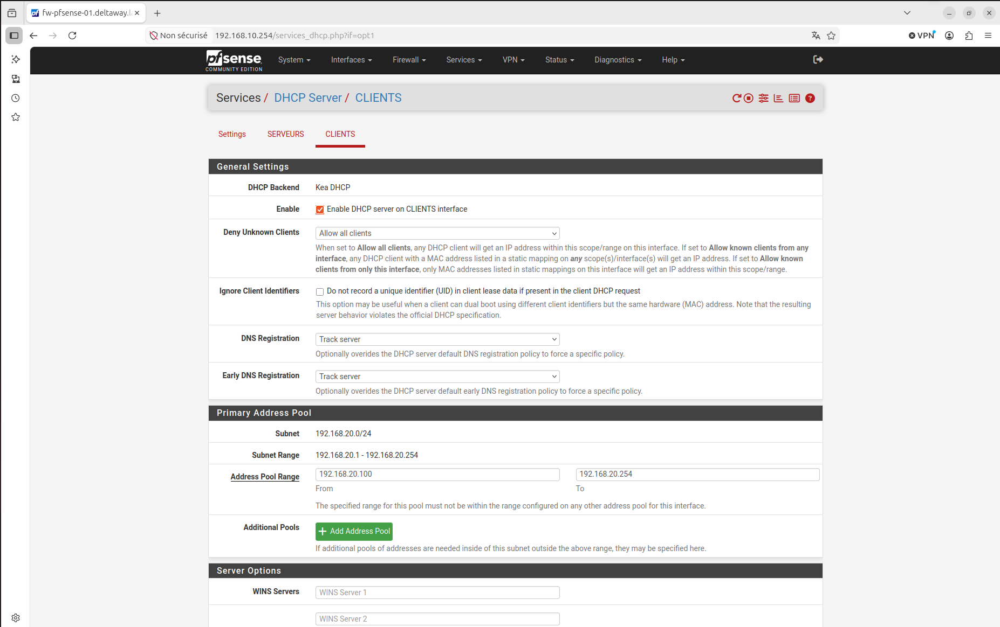
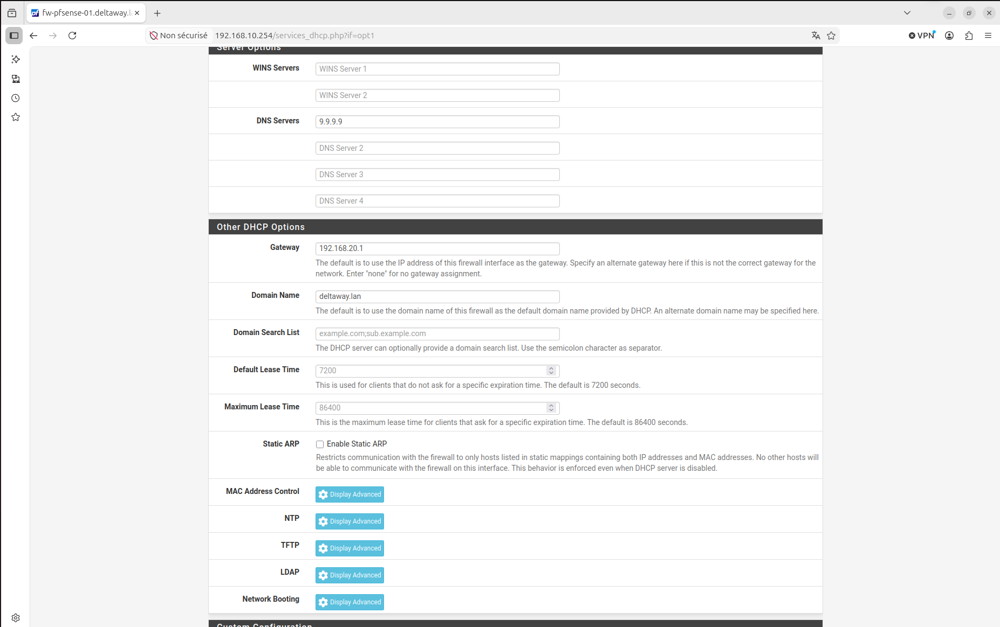
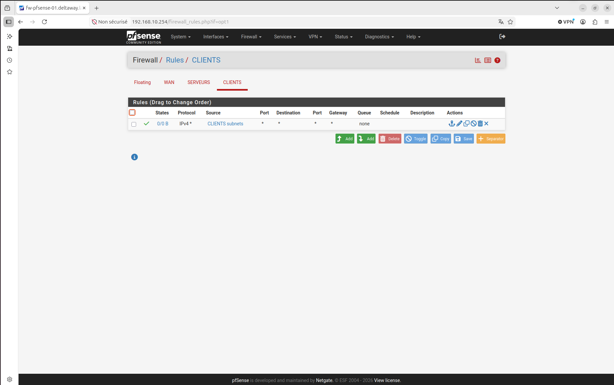
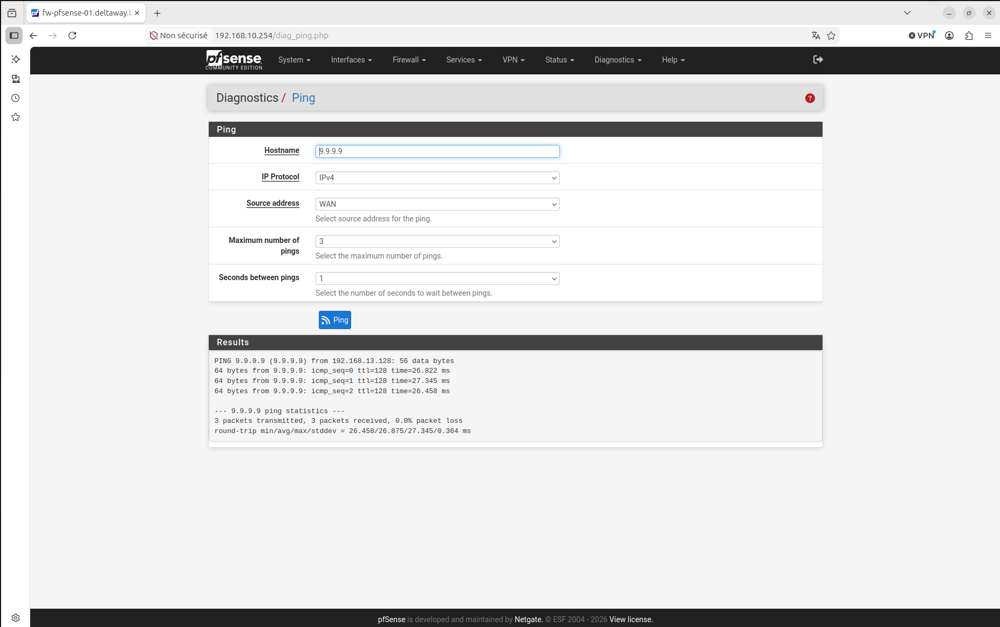

# fw-pfsense-01 — Routeur/Firewall

## Rôle dans l'infrastructure

pfSense est le cœur de l'infrastructure DeltaWay. Il est déployé en 
premier car le réseau est la fondation de toute infrastructure — sans 
lui, les serveurs et clients ne peuvent pas communiquer entre eux ni 
accéder à internet pour télécharger des paquets ou des mises à jour.

## Choix techniques

**pfSense CE** a été choisi car il offre les fonctionnalités d'un 
firewall/routeur professionnel sans coût de licence. Une alternative 
crédible est OPNsense — un fork 100% open source de pfSense, 
activement maintenu.

**ZFS** a été choisi comme système de fichiers lors de l'installation 
car il offre une meilleure intégrité des données (somme de contrôle
"checksum" pour vérifier que les données n'ont pas été corrompues) et 
des fonctionnalités de snapshot utiles en environnement virtualisé.

**Quad9 (9.9.9.9)** a été choisi comme DNS public temporaire — 
fondation suisse, axée sécurité et privacy, conforme au RGPD. 
Il sera remplacé par le DNS du Windows Server une fois l'AD déployé.

**deltaway.lan** plutôt que deltaway.local — pfSense avertit que 
`.local` est réservé au protocole mDNS* (Bonjour, Avahi) et peut 
créer des conflits de résolution DNS avec certains équipements réseau.

*mDNS (Multicast DNS) est un protocole qui permet aux appareils 
d'un réseau local de se découvrir automatiquement sans serveur DNS 
(ex: imprimantes AirPrint, Apple TV). Il utilise le suffixe .local 
par convention — d'où le conflit potentiel avec un domaine AD en 
.local et la préférence pour .lan.

## Architecture réseau

| Interface | VMnet | Type | IP | Rôle |
|-----------|-------|------|----|------|
| em0 (WAN) | vmnet8 | NAT | DHCP automatique | Accès internet |
| em1 (SERVEURS) | vmnet2 | Host-only | 192.168.10.254/24* | VLAN Serveurs |
| em2 (CLIENTS) | vmnet3 | Host-only | 192.168.20.1/24 | VLAN Clients |

*Temporairement en .254 — voir incident ci-dessous.

## Configuration réalisée



### Paramètres généraux
- Hostname : `fw-pfsense-01`
- Domaine : `deltaway.lan`
- DNS : `9.9.9.9` (Quad9) — sera remplacé par le DNS Windows Server
- Timezone : `Europe/Paris` — essentiel pour la cohérence des logs
  et la corrélation d'incidents entre machines



### DHCP
Activé uniquement sur l'interface CLIENTS :
- Pool : `192.168.20.100` à `192.168.20.254`
- Les serveurs conservent des IPs fixes — ils doivent être joignables
  en permanence à une adresse stable




### Règles firewall
- CLIENTS → SERVEURS et internet : autorisé
- Les règles seront durcies en phase 2 pour appliquer le principe
  de moindre privilège — les clients n'accèderont qu'aux services
  dont ils ont besoin



### Administration
L'interface web est accessible via `http://192.168.10.254`.
Par sécurité, on n'administre jamais un firewall depuis l'interface 
WAN — uniquement depuis le réseau interne.

## Incident — Conflit d'adresse IP

En tentant d'accéder à l'interface web depuis l'hôte Ubuntu, 
la connexion échouait. Diagnostic avec `ip a` : l'hôte Ubuntu 
possède une interface virtuelle vmnet2 automatiquement configurée 
en `192.168.10.1` par VMware — même adresse que l'interface LAN 
de pfSense, d'où le conflit.

**Solution temporaire** : l'interface SERVEURS de pfSense est 
provisoirement en `192.168.10.254`. Elle sera remise en 
`192.168.10.1` une fois un poste client installé sur le réseau, 
permettant de désactiver la carte vmnet2 de l'hôte Ubuntu.

**Leçon** : en environnement de virtualisation, VMware attribue 
automatiquement une IP à l'hôte sur chaque réseau virtuel créé. 
Il faut anticiper ces conflits lors de la conception de l'adressage.

## Test de validation

Ping depuis pfSense vers `9.9.9.9` via l'interface WAN → succès ✅

Le firewall est opérationnel et connecté à internet.




## Mise à jour — Correction IP interfaces SERVEURS et CLIENTS

**Date :** Juin 2026

L'interface SERVEURS de pfSense était temporairement configurée en
`192.168.10.254` suite à un conflit d'adresse avec l'hôte Ubuntu.
Maintenant que le poste client Windows 11 est installé et fonctionnel,
je remets l'adressage en ordre pour respecter la convention définie
dès la conception.

**Le problème**

VMware attribue automatiquement l'adresse `.1` de chaque subnet à
l'hôte Ubuntu sur ses interfaces virtuelles vmnet. Mon Ubuntu avait
donc `192.168.10.1` sur vmnet2 et `192.168.20.1` sur vmnet3 — en
conflit direct avec les passerelles pfSense.

**La solution envisagée initialement**

Désactiver la carte vmnet2 de l'hôte Ubuntu pour libérer le `.1`.
Solution fonctionnelle mais pas propre car je souhaite quand même
continuer d'administrer mon serveur debian avec mon hôte ubuntu.

**La solution retenue — Netplan**

En cherchant une solution plus propre j'ai découvert **Netplan** —
l'outil de configuration réseau moderne sur Ubuntu, que je ne
connaissais pas. L'équivalent du `/etc/network/interfaces` sur Debian
mais en format YAML.

J'ai créé un fichier de configuration dédié aux interfaces VMware :
`/etc/netplan/99-vmnet.yaml`

```yaml
network:
  version: 2
  ethernets:
    vmnet2:
      addresses:
        - 192.168.10.253/24
    vmnet3:
      addresses:
        - 192.168.20.253/24
```

Les deux interfaces vmnet sont maintenant fixées en `.253` de façon
permanente — au redémarrage Ubuntu applique automatiquement cette
configuration.

**Actions effectuées**

- vmnet2 → `192.168.10.253` (libère le `.1` pour pfSense)
- vmnet3 → `192.168.20.253` (évite un futur conflit côté VLAN clients)
- Interface SERVEURS pfSense → remise en `192.168.10.1` ✅
- Passerelle srv-win-01 → mise à jour en `192.168.10.1`
- Passerelle srv-deb-01 → mise à jour via `/etc/network/interfaces`

**Convention d'adressage maintenant respectée ✅**

| Interface | IP |
|-----------|-----|
| pfSense SERVEURS | 192.168.10.1 |
| pfSense CLIENTS | 192.168.20.1 |
| srv-win-01 | 192.168.10.10 |
| srv-deb-01 | 192.168.10.20 |
| pc-win-01 | DHCP 192.168.20.100-254 |
