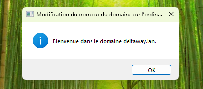
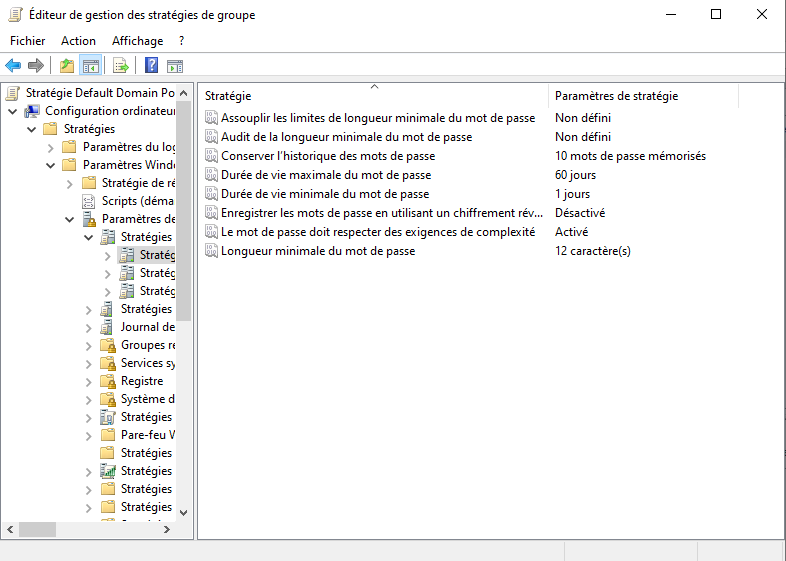
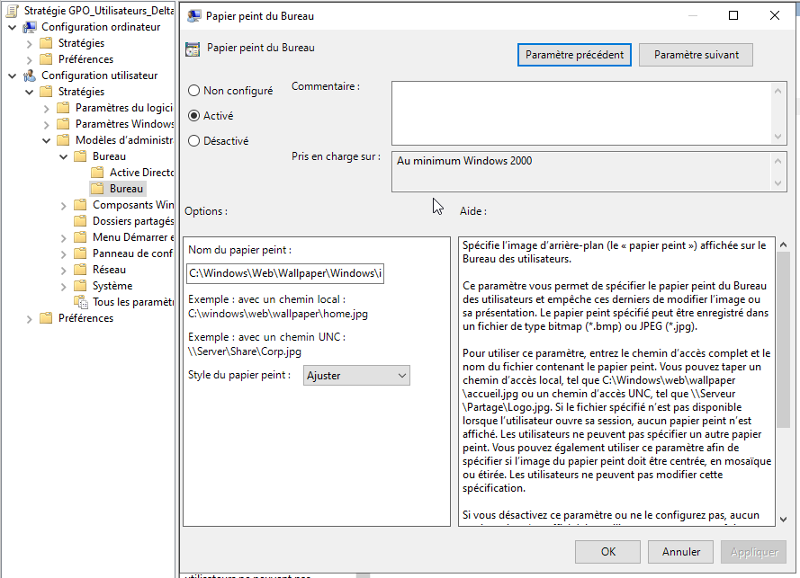
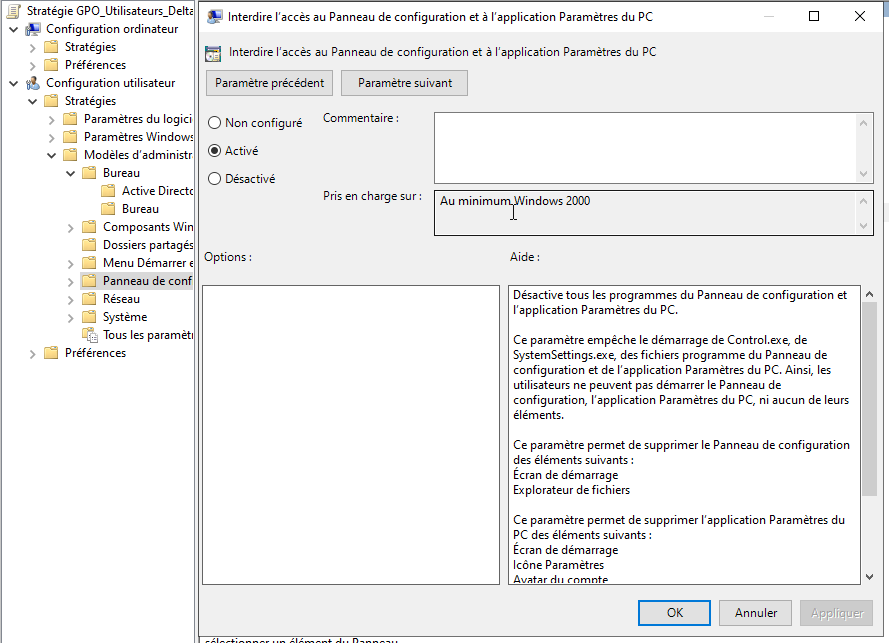
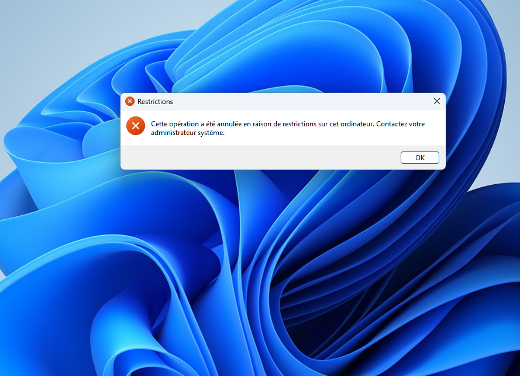

# pc-win-01 — Poste client Windows 11

## Rôle dans l'infrastructure

pc-win-01 simule le poste de travail d'un utilisateur DeltaWay.
C'est sur ce poste que les utilisateurs AD se connectent avec leurs
identifiants centralisés et que les GPO s'appliquent concrètement.

## Pourquoi joindre un poste au domaine

Joindre un poste au domaine Active Directory c'est ce qui fait le lien
entre le poste physique et l'infrastructure centralisée :

- **Authentification centralisée** — un utilisateur peut se connecter
  avec ses identifiants AD sans qu'on ait créé de compte local sur
  la machine. a.martin peut se connecter sur n'importe quel poste
  du domaine avec les mêmes identifiants.
- **Application des GPO** — dès qu'un poste rejoint le domaine les
  politiques de groupe s'appliquent automatiquement — sécurité,
  restrictions, configurations.
- **Gestion centralisée** — le poste apparaît dans l'AD, on peut
  le gérer à distance et appliquer des configurations sans se déplacer.
- **Sécurité** — le poste est connu et contrôlé par l'infrastructure.
  Un poste non joint au domaine est un poste non maîtrisé.

## Installation

Windows 11 Enterprise (version évaluation 180 jours) — c'est la version
utilisée en entreprise, elle supporte la jonction au domaine
et toutes les fonctionnalités GPO.

Après installation :
- Installation des VMware Tools
- Renommage en `pc-win-01` — respect de la convention de nommage

## Jonction au domaine

Avant de joindre le domaine on configure le DNS sur le poste :
- **DNS** : `192.168.10.10` (srv-win-01)

Le poste doit interroger le DNS de Windows Server pour trouver
le contrôleur de domaine `deltaway.lan`. Sans ça la jonction échoue.

Jonction via **Paramètres système** → **Modifier** → **Domaine**
→ `deltaway.lan` → identifiants Administrateur.

## Incident — Poste sans adresse IP (APIPA)

### Symptôme
Impossible de contacter le contrôleur de domaine. Ping vers
`192.168.10.10` → "Défaillance générale". Le poste avait une
adresse APIPA `169.254.x.x` — il n'avait pas reçu d'adresse
DHCP.

### Diagnostic
`ipconfig /release /renew` → échec. Le service DHCP de Windows
Server semblait actif mais ne distribuait pas d'adresses.

Deux problèmes identifiés :

**1. DHCP Relay manquant**
Le poste client est sur le VLAN 20 et le serveur DHCP est sur
le VLAN 10. Les broadcasts DHCP ne traversent pas les VLANs —
pfSense doit relayer les requêtes DHCP du VLAN clients vers
Windows Server. Sans DHCP Relay configuré sur pfSense, le poste
ne reçoit jamais de réponse à sa requête DHCP.

Configuration du DHCP Relay sur pfSense :
- Interface downstream : CLIENTS
- Serveur DHCP upstream : `192.168.10.10`

**2. Service DHCP Windows Server en erreur**
Malgré le DHCP Relay configuré, le poste ne recevait toujours
pas d'IP. En consultant la console DHCP on constatait une icône
rouge sous IPv4 et IPv6 — le service était en erreur.

### Résolution
Redémarrage du service DHCP via la console :
```cmd
Restart-Service DHCPServer
```

### Mauvaise pratique identifiée
Je pense que redémarrer un service sans comprendre la cause racine n'est pas
une bonne pratique en production. La bonne démarche aurait été
de consulter l'**Observateur d'événements** → **Journaux Windows**
→ **Système** → source **DHCPServer** pour identifier l'erreur
exacte avant d'agir.

En production un service DHCP qui tombe c'est un incident critique
— tous les postes qui renouvellent leur bail se retrouvent sans IP.

### Leçon
En admin Windows : toujours consulter les Event Logs avant de
redémarrer un service. Et toujours configurer le DHCP Relay sur
pfSense quand le serveur DHCP et les clients sont sur des VLANs
différents.



## Test de connexion

Connexion avec `a.martin` sur `pc-win-01` → succès ✅

Un utilisateur AD peut se connecter sur le poste sans compte
local — c'est la validation concrète de l'infrastructure centralisée.

## GPO configurées

### GPO 1 — Politique de mots de passe
Appliquée sur : **Default Domain Policy** (tout le domaine)

| Paramètre | Valeur |
|-----------|--------|
| Longueur minimale | 12 caractères |
| Complexité | Activée |
| Durée de vie maximale | 60 jours |
| Durée de vie minimale | 1 jour |
| Historique | 10 mots de passe |



### GPO 2 — Restrictions utilisateurs
Appliquée sur : **OU DeltaWay_Utilisateurs**
Nom : `GPO_Utilisateurs_DeltaWay`

**Fond d'écran d'entreprise**
Chemin : `C:\Windows\Web\Wallpaper\Windows\img0.jpg`

En production on utiliserait le logo DeltaWay stocké dans un
dossier partagé accessible par tous les postes. Tous les postes
vont chercher le fond d'écran au chemin indiqué — si le fichier
n'existe pas à ce chemin le fond d'écran ne s'applique pas.
L'avantage du dossier partagé c'est de pouvoir changer le fond
d'écran pour toute l'entreprise en remplaçant un seul fichier.

Cas d'usage en entreprise :
- Image de marque uniforme
- Affichage d'informations importantes (support IT, règles sécu)
- Avertissement légal obligatoire dans certains secteurs
  (banque, défense)



**Blocage du panneau de configuration**
Les utilisateurs standard ne peuvent pas modifier les paramètres
système — ils ne peuvent pas désinstaller des logiciels, modifier
les paramètres réseau ou changer la configuration du poste.



## Test des GPO

```cmd
gpupdate /force
```

Déconnexion/reconnexion avec `a.martin` → GPO appliquées ✅
- Fond d'écran DeltaWay visible
- Panneau de configuration inaccessible



