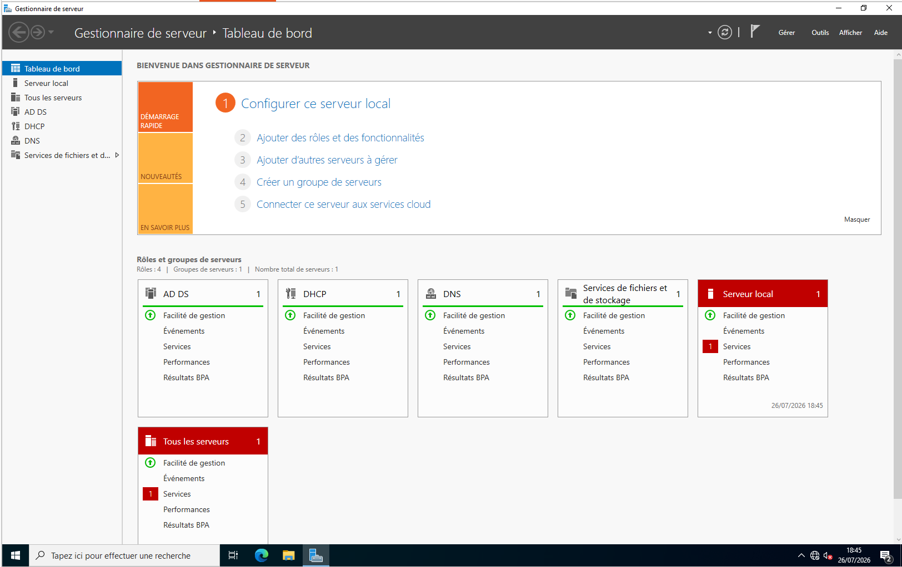
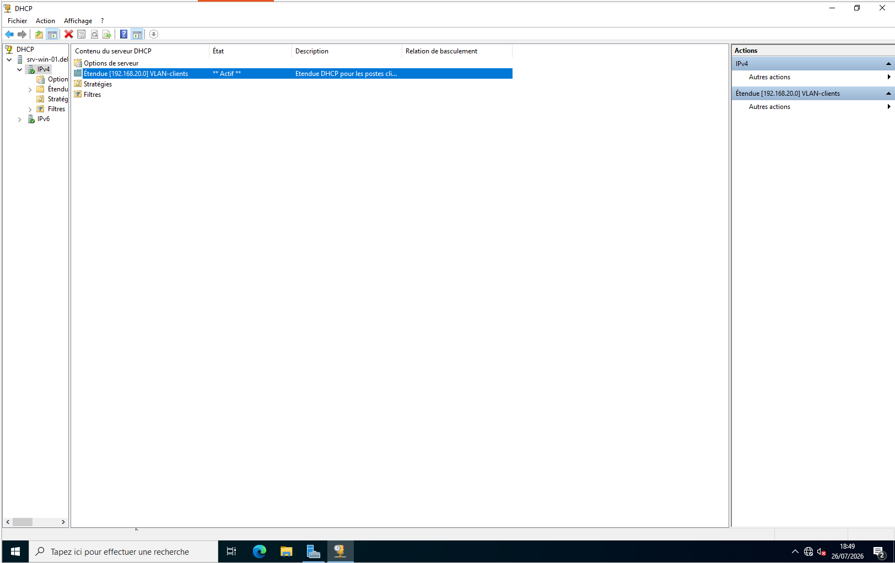
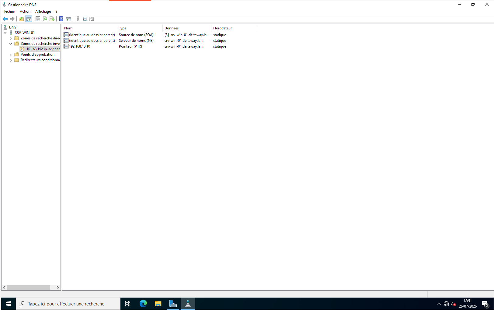
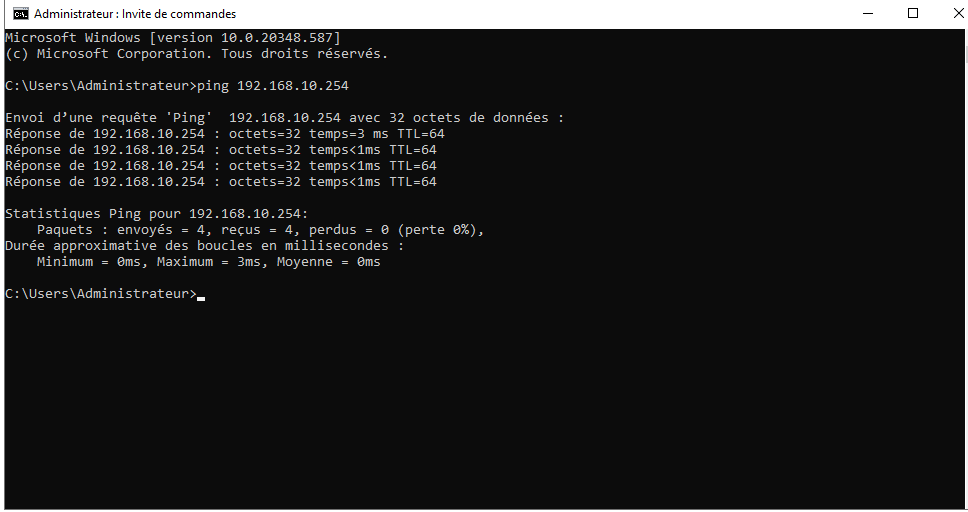
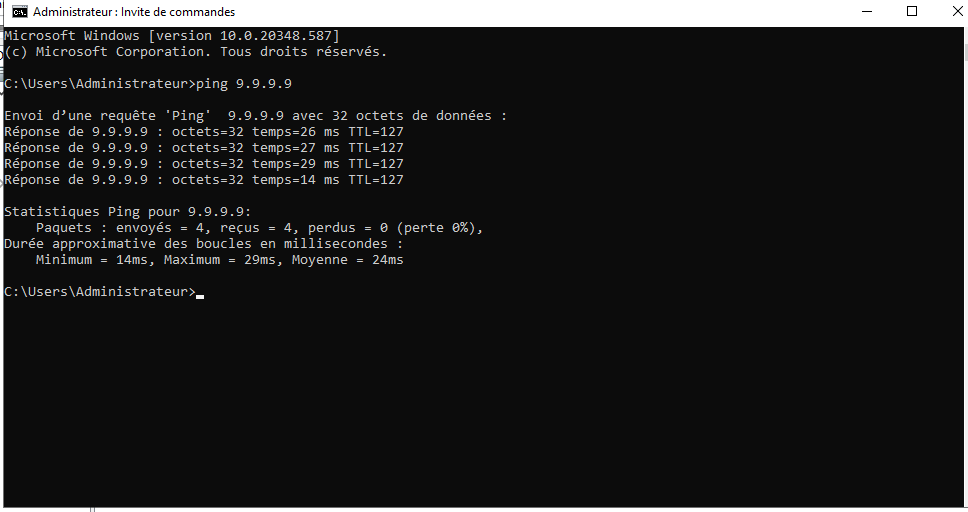
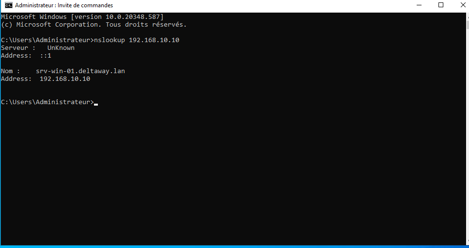

# srv-win-01 — Windows Server 2022

## Rôle dans l'infrastructure

srv-win-01 est le serveur central de l'infrastructure DeltaWay. Il héberge
trois services essentiels : l'Active Directory, le DNS et le DHCP.

## Choix techniques

**Windows Server avec interface graphique (Desktop Experience)** a été choisi
pour cette phase afin de maîtriser chaque configuration visuellement. À terme,
une fois PowerShell maîtrisé, on migrera vers un server sans interface
graphique — plus léger et plus sécurisé car une interface graphique représente 
une surface d'attaque supplémentaire.

**Migration du DHCP de pfSense vers Windows Server**

Le DHCP a été installé directement sur Windows Server plutôt que de conserver
celui de pfSense. Trois raisons principales :

- **Client** - à la base je voulais installer le client avant le serveur
  pour avoir un poste pour l'administrer mais j'ai décidé d'administrer et 
  de configurer mon serveur via mon hôte ubuntu. Le client sera installé à 
  la prochaine étape donc le DHCP du pfSense n'a plus lieu d'être (le client 
  recevra directement une adresse IP du Windows Server).
- **Intégration AD/DNS** — quand un poste rejoint le domaine, il s'enregistre
  automatiquement dans le DNS. Avec pfSense ce n'est pas possible car il ne
  connaît pas l'AD.
- **Environnement natif AD** — l'objectif à moyen terme est une infrastructure
  hybride on-premise/Azure. Avoir le DHCP intégré à l'AD facilite cette
  évolution.

Sur une infrastructure plus petite sans AD, pfSense comme serveur DHCP est
parfaitement valable. Les choix d'architecture s'adaptent toujours au contexte
— taille de l'entreprise, budget, présence ou non d'un AD.

**DNS intégré à l'AD**

Le DNS de Windows Server est directement lié à l'AD — quand un poste rejoint
le domaine il s'enregistre automatiquement. pfSense a été mis à jour pour
utiliser l'IP de Windows Server comme DNS afin de résoudre les noms internes
`deltaway.lan`. Sans ça pfSense interrogerait Quad9 qui ne connaît pas le
domaine interne.

## Configuration réseau

| Paramètre | Valeur |
|-----------|--------|
| IP | 192.168.10.10/24 |
| Passerelle | 192.168.10.254 (pfSense) |
| DNS préféré | 127.0.0.1 (lui-même) |
| DNS auxiliaire | 9.9.9.9 (Quad9 — secours) |

## Installation des rôles

Trois rôles installés en une seule fois via le Gestionnaire de serveur :

- **AD DS** — Services de domaine Active Directory
- **Serveur DNS** — intégré à l'AD
- **Serveur DHCP** — remplacement du DHCP pfSense



## Promotion en contrôleur de domaine

Après l'installation des rôles, le serveur est promu en contrôleur de domaine.
C'est cette étape qui crée réellement le domaine `deltaway.lan` et désigne
`srv-win-01` comme pièce centrale de l'infrastructure — c'est lui qui fait
autorité sur toutes les identités et machines du domaine.

## Configuration DHCP

| Paramètre | Valeur |
|-----------|--------|
| Étendue | VLAN-Clients |
| Pool | 192.168.20.100 — 192.168.20.254 |
| Passerelle | 192.168.20.1 (pfSense) |
| DNS | 192.168.10.10 (srv-win-01) |
| Domaine | deltaway.lan |
| Durée du bail | 8 jours |

Pas d'exclusions nécessaires — la convention d'adressage réserve déjà
les adresses `.1` à `.99` en dehors du pool.

Note sur la durée du bail : 8 jours est une valeur standard pour des postes
fixes en entreprise. Dans un environnement avec des machines mobiles ou à
fort turnover (hôtels, conférences) on mettrait 2 à 4 heures maximum.



## Structure Active Directory

deltaway.lan
- DeltaWay_Utilisateurs
  - a.martin (Alice Martin)
  - b.dupont (Bob Dupont)
  - c.durand (Claire Durand)
- DeltaWay_Groupes
  - GG_Developpement -> a.martin
  - GG_Commercial -> b.dupont
  - GG_RH -> c.durand
- DeltaWay_Ordinateurs

Les OUs permettent d'organiser les objets AD et d'appliquer des GPO
spécifiques à chaque catégorie. En mettant les utilisateurs directement
à la racine du domaine on perdrait cette organisation.

Les groupes suivent la convention Microsoft :
- `GG_` → Groupe Global de sécurité

## Configuration DNS

**Forwarder** : les requêtes externes non résolues par le DNS interne
sont transmises à Quad9 `9.9.9.9`.

**Zone de recherche directe** : `deltaway.lan` — créée automatiquement
lors de la promotion en contrôleur de domaine.

**Zone de recherche inversée** : `10.168.192.in-addr.arpa` — résolution
IP vers nom. Utile pour les diagnostics — logs lisibles avec les noms
de machines plutôt que les IPs, et commandes comme `ping -a` ou `nslookup`.



## Tests de validation

```cmd
ping 192.168.10.254   # pfSense accessible ✅
ping 9.9.9.9          # Internet accessible ✅
ping google.com       # Résolution DNS fonctionnelle ✅
nslookup 192.168.10.10 # Résolution inversée fonctionnelle ✅
```




## GPO

Les GPO seront configurées lors de l'installation du poste client
Windows 11 — elles n'ont de sens qu'avec des machines jointes au domaine.
