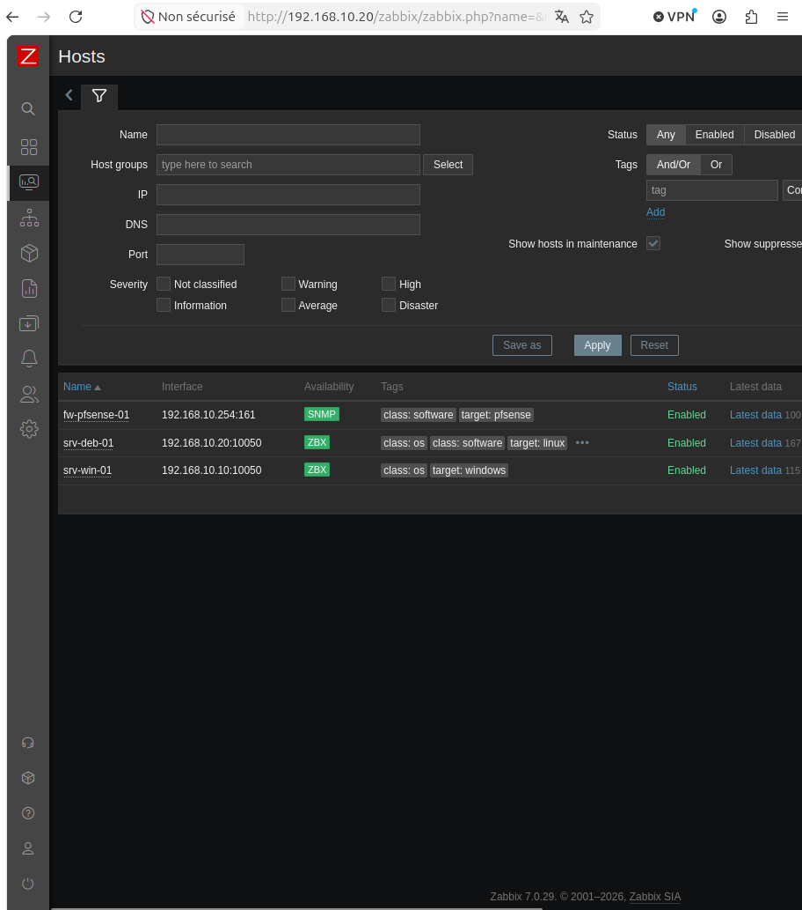
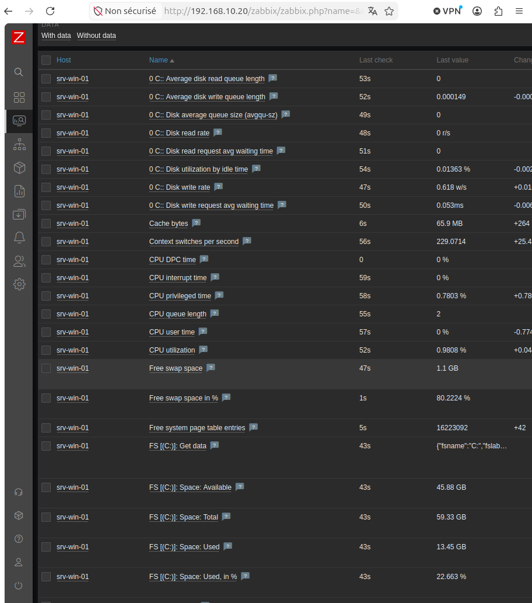
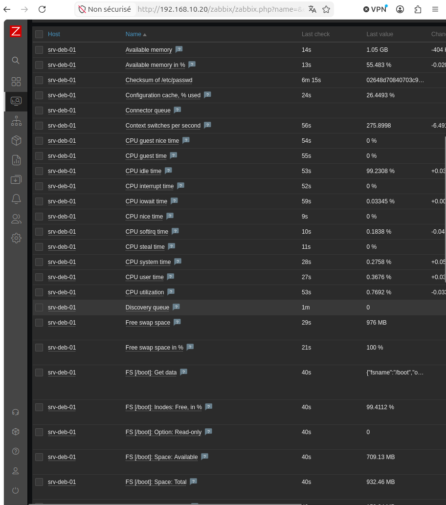
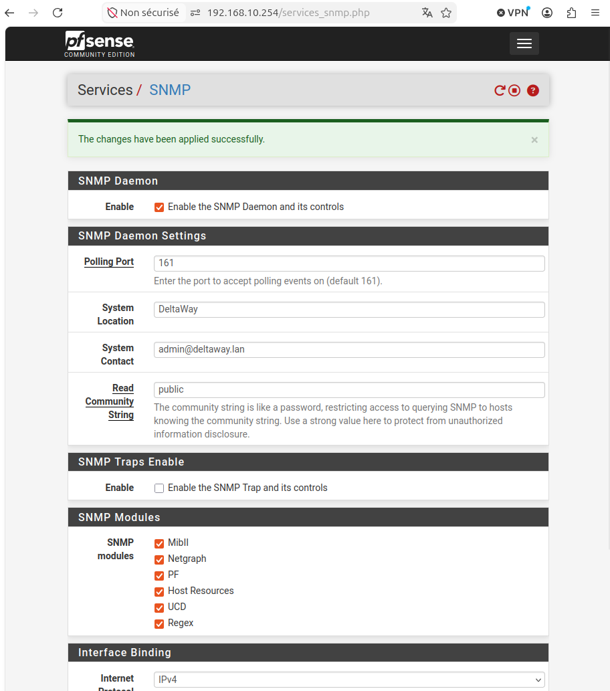

# Zabbix — Supervision de l'infrastructure DeltaWay (première installation et utilisation)

## Rôle dans l'infrastructure

Zabbix est l'outil de supervision de l'infrastructure DeltaWay. Il
monitore en temps réel toutes les machines — CPU, RAM, disque, état
des services — et permet d'être alerté avant que les problèmes
impactent les utilisateurs.

Un technicien réagit aux problèmes. Un admin les anticipe. La
supervision c'est ce qui fait cette différence.

## Architecture Zabbix

Zabbix fonctionne avec deux composants principaux :

**Serveur Zabbix** — le cerveau. Il reçoit et collecte les données
remontées par les agents, les stocke dans MariaDB et les affiche
dans l'interface web.

**Agent Zabbix** — installé sur chaque machine à superviser. Il
collecte les données localement (CPU, RAM, disque, services) et les
envoie au serveur. Exception : pfSense utilise SNMP à la place d'un
agent car c'est un appliance réseau sur lequel on n'installe pas de
logiciels tiers.

**SNMP** — protocole natif sur les équipements réseau. pfSense expose
ses métriques via SNMP sans nécessiter d'agent.

## Machines supervisées

| Machine | Méthode | Statut |
|---------|---------|--------|
| srv-deb-01 | Zabbix Agent | ✅ |
| srv-win-01 | Zabbix Agent 2 | ✅ |
| fw-pfsense-01 | SNMP | ✅ |

## Installation

### 1. MariaDB

MariaDB est une dépendance de Zabbix — il ne peut pas démarrer sans
base de données pour stocker ses données.

```bash
sudo apt install mariadb-server -y
```

**Sécurisation manuelle de MariaDB :**

```sql
-- Supprimer les utilisateurs anonymes
DELETE FROM mysql.user WHERE User='';

-- Interdire la connexion root depuis le réseau
DELETE FROM mysql.user WHERE User='root' AND Host NOT IN ('localhost', '127.0.0.1', '::1');

-- Supprimer la base de données test
DROP DATABASE IF EXISTS test;

-- Appliquer les changements
FLUSH PRIVILEGES;
```

Ces commandes appliquent le principe du moindre privilège à MariaDB —
on supprime tout ce qui n'est pas nécessaire.

**Création de la base de données et de l'utilisateur Zabbix :**

```sql
-- Créer la base de données
CREATE DATABASE zabbix CHARACTER SET utf8mb4 COLLATE utf8mb4_bin;

-- Créer un utilisateur dédié — pas de compte root pour Zabbix
CREATE USER 'zabbix'@'localhost' IDENTIFIED BY 'motdepasse';

-- Donner les droits uniquement sur la base zabbix
GRANT ALL PRIVILEGES ON zabbix.* TO 'zabbix'@'localhost';

FLUSH PRIVILEGES;
```

Zabbix a son propre utilisateur MariaDB avec accès uniquement à sa
base de données — principe du moindre privilège.

### 2. Dépôt officiel Zabbix

Les dépôts Debian ne contiennent pas tous les paquets Zabbix
nécessaires. On ajoute le dépôt officiel :

```bash
wget https://repo.zabbix.com/zabbix/7.0/debian/pool/main/z/zabbix-release/zabbix-release_latest_7.0+debian13_all.deb
sudo dpkg -i zabbix-release_latest_7.0+debian13_all.deb
sudo apt update
```

Le fichier `.deb` ajoute le dépôt ET installe la clé GPG — sans cette
clé apt refuserait les paquets comme source non fiable.

### 3. Installation des paquets Zabbix

```bash
sudo apt install zabbix-server-mysql zabbix-frontend-php zabbix-apache-conf zabbix-sql-scripts zabbix-agent apache2 -y
```

| Paquet | Rôle |
|--------|------|
| zabbix-server-mysql | Le serveur — cerveau de la supervision |
| zabbix-frontend-php | Interface web en PHP |
| zabbix-apache-conf | Configuration Apache pour Zabbix |
| zabbix-sql-scripts | Scripts de création de la structure MariaDB |
| zabbix-agent | Agent pour superviser srv-deb-01 lui-même |
| apache2 | Serveur web pour servir l'interface PHP |

**Pourquoi Apache et pas Nginx ?**

Nginx est plus performant avec beaucoup d'utilisateurs simultanés.
Pour un homelab avec un seul utilisateur Apache est largement
suffisant et Zabbix le configure automatiquement — moins de
configuration manuelle.

### 4. Import de la structure MariaDB

```bash
sudo zcat /usr/share/zabbix-sql-scripts/mysql/server.sql.gz | sudo mysql --default-character-set=utf8mb4 -uzabbix -p zabbix
```

Ce fichier contient toutes les instructions SQL pour créer les tables,
index et données initiales de Zabbix. Sans ça la base serait vide et
Zabbix ne saurait pas où stocker ses données.

### 5. Configuration du serveur Zabbix

```bash
sudo nano /etc/zabbix/zabbix_server.conf
```

Configurer le mot de passe MariaDB :
```bash
DBPassword="motdepasse"
```
Zabbix se connecte en arrière-plan à MariaDB en permanence pour
stocker et lire ses données — il a besoin de ce mot de passe.

### 6. Démarrage des services

```bash
sudo systemctl restart zabbix-server zabbix-agent apache2
sudo systemctl enable zabbix-server zabbix-agent apache2
```

### 7. Configuration via l'interface web

Accès : `http://192.168.10.20/zabbix`

Identifiants par défaut : `Admin` / `zabbix`
**À changer immédiatement après la première connexion.**

## Installation des agents

### srv-win-01 — Zabbix Agent 2

Téléchargement depuis le site officiel Zabbix — version 7.0 LTS,
Windows, amd64, MSI, avec OpenSSL.

Paramètres d'installation :
- Zabbix server IP : `192.168.10.20`
- Host name : `srv-win-01`

Une règle firewall entrante est créée automatiquement par l'installateur
MSI sur le port TCP `10050`.

**Pourquoi une règle entrante ?**
Le serveur Zabbix contacte l'agent sur le port `10050` — du point de
vue de `srv-win-01` c'est une connexion entrante.

### fw-pfsense-01 — SNMP

Activation SNMP sur pfSense : **Services** → **SNMP**

- Port : `161`
- Community : `public`

Ajout dans Zabbix avec le template `pfSense by SNMP` et une interface
SNMP v2 sur `192.168.10.254:161`.

## Incident — srv-deb-01 en rouge

### Symptôme
`srv-deb-01` passait en rouge dans Zabbix avec l'erreur :
`Received empty response from Zabbix Agent at [192.168.10.20].
Assuming that agent dropped connection because of access permissions.`

### Cause
Le fichier de configuration de l'agent `/etc/zabbix/zabbix_agentd.conf`
contenait uniquement `Server=127.0.0.1`. Le serveur Zabbix contacte
l'agent depuis `192.168.10.20` — cette IP n'étant pas autorisée,
l'agent refusait la connexion.

Même si le serveur Zabbix et l'agent sont sur la même machine, le
serveur contacte l'agent via son IP réseau `192.168.10.20` et non
via `127.0.0.1`.

### Résolution

```bash
sudo nano /etc/zabbix/zabbix_agentd.conf
```

Modification de la directive Server :

```bash
Server=127.0.0.1,192.168.10.20
```

```bash
sudo systemctl restart zabbix-agent
```

## Screenshots





